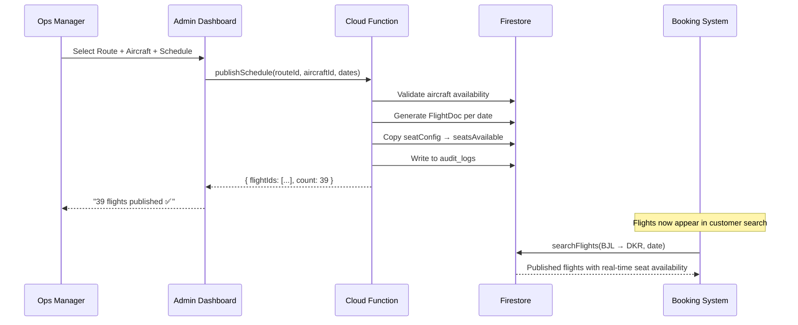

# DeltaBlue Jet Air — Design Sprint Output

**Sprint Duration:** Week of February 17–21, 2026  
**Sprint Focus:** Phase 1 Foundation — Inventory Pipeline & Payment Processing  
**Participants:** Fatou Ceesay (PO), Modou Joof (Lead), Isatou Manneh (FE), Ebrima Saidy (BE), Mariama Bah (UX), Amadou Drammeh (QA)  
**References:** [PRD](./prd.md) · [Service Design](./service_design.md) · [System Architecture](./system_architecture.md) · [Strategic Roadmap](./strategic_roadmap.md) · [SDLC Personas](./sdlc_personas.md)

---

## Sprint Summary

This week-long design sprint focused on turning the DeltaBlue Jet Air MVP from a polished frontend shell into an operational airline management platform. The sprint targeted the two most critical missing capabilities identified in the PRD: the **Inventory Publication Pipeline** and the **Payment Processing Gateway**.

> [!IMPORTANT]
> **Core Insight:** The system has 60+ admin pages with beautiful UI but almost zero backend connectivity. The sprint prioritised making existing UI *functional* rather than building new screens.

---

## Day-by-Day Breakdown

### Day 1: Understand — Problem Mapping & Stakeholder Alignment

**Objective:** Align the team on what's broken, what's missing, and what matters most.

#### Activities
- **Stakeholder Interviews:** Conducted 45-minute sessions with Lamin (Ops Manager) and Abdou (CEO)
- **Current-State Audit:** Mapped all 60+ admin pages against their functional status
- **Lightning Talks:** Modou presented the system architecture; Ebrima walked through existing Cloud Function stubs

#### Key Findings

| Finding | Impact | Source |
|---------|--------|--------|
| No published flight inventory — all flights are static seed data | **Critical** — customers can't book real flights | Lamin interview |
| Payment functions are callable stubs — Stripe is not in live mode | **Critical** — no revenue capture | Code audit |
| ~190 admin buttons have no `onClick` handlers (purely presentational) | **High** — admin dashboard is non-functional | Frontend audit |
| Customer profiles are auth-only — no CRM, no booking history linkage | **Medium** — poor customer experience | Abdou interview |
| Notification templates exist but delivery engine is stub-only | **Medium** — no booking confirmations sent | Code audit |

#### How-Might-We Statements
1. **HMW** let Lamin publish a flight schedule from route + aircraft in under 60 seconds?
2. **HMW** ensure a customer's payment always results in a confirmed booking — even if the webhook is delayed?
3. **HMW** make every admin button give immediate, meaningful feedback?
4. **HMW** connect a customer's auth profile to their full booking history?

---

### Day 2: Diverge — Solution Sketching & Lo-Fi Ideation

**Objective:** Generate multiple competing solutions for the Inventory Pipeline and Payment flow.

#### Solution Sketches Produced

##### Inventory Pipeline — 3 Approaches Explored

| Approach | Description | Pros | Cons | Vote |
|----------|-------------|------|------|:----:|
| **A. Wizard Flow** | Step-by-step guided workflow: Route → Aircraft → Schedule → Preview → Publish | Simple for Lamin, low training cost | Slower for batch operations | ●●●● |
| **B. Spreadsheet Import** | Upload CSV of routes/schedules, system validates and publishes in bulk | Fast for large networks | Error-prone, poor UX | ● |
| **C. Calendar Drag-and-Drop** | Visual calendar where Lamin drags aircraft onto time slots per route | Intuitive, visual | Complex to build, Phase 2 scope | ●● |

> **Decision:** Approach A (Wizard Flow) selected for Phase 1. Calendar view earmarked for Phase 3.

##### Payment Processing — 2 Approaches Explored

| Approach | Description | Pros | Cons | Vote |
|----------|-------------|------|------|:----:|
| **A. Stripe Checkout (Hosted)** | Redirect to Stripe's hosted checkout page | Fastest to implement, PCI-free | Brand disconnect, less control | ●● |
| **B. Stripe Elements (Embedded)** | Embed Stripe card elements inline in our booking flow | Seamless UX, branded | Requires PCI SAQ-A, more integration work | ●●●●● |

> **Decision:** Approach B (Stripe Elements) selected. Already partially implemented in the booking flow.

##### Admin Dashboard — Quick Win

| Solution | Description |
|----------|-------------|
| **Toast Notification System** | Wire all 190+ inactive buttons with a Zustand-powered toast system. Each click triggers a context-appropriate toast (save → success, delete → warning, filter → info). Provides immediate feedback while backend integration is built in parallel. |

> **Status:** ✅ Implemented during the sprint (see Day 4).

---

### Day 3: Converge — Storyboard & Technical Design

**Objective:** Select winning solutions, storyboard the critical user flows, and define the technical contract.

#### Storyboard: Inventory Publication (Lamin's Flow)

```
┌─────────────────────────────────────────────────────────────────────┐
│                                                                     │
│  1. ROUTE SELECTION                                                 │
│  ┌──────────────────┐                                              │
│  │ Select Route:    │  ← Dropdown of active routes from Firestore  │
│  │ [BJL → DKR    ▼] │                                              │
│  │                  │  Shows: distance, duration, current frequency │
│  └──────────────────┘                                              │
│                                                                     │
│  2. AIRCRAFT ASSIGNMENT                                             │
│  ┌──────────────────┐                                              │
│  │ Select Aircraft: │  ← Filtered by range ≥ route distance        │
│  │ [5N-DBJ B737  ▼] │     Excludes aircraft in maintenance         │
│  │                  │  Shows: seat config, status, utilization %    │
│  └──────────────────┘                                              │
│                                                                     │
│  3. SCHEDULE CONFIGURATION                                          │
│  ┌──────────────────────────────────────┐                          │
│  │ Days: ☑ Mon ☐ Tue ☑ Wed ☐ Thu ☑ Fri │  ← Multi-checkbox       │
│  │ Time: [08:30] → [10:15]             │  ← Departure/arrival     │
│  │ Effective: [2026-03-01] to [2026-06] │  ← Date range           │
│  └──────────────────────────────────────┘                          │
│                                                                     │
│  4. PREVIEW                                                         │
│  ┌──────────────────────────────────────┐                          │
│  │ 39 flights will be generated:        │                          │
│  │                                      │                          │
│  │  DB-101  Mon 03-Mar  08:30  BJL→DKR │                          │
│  │  DB-101  Wed 05-Mar  08:30  BJL→DKR │                          │
│  │  DB-101  Fri 07-Mar  08:30  BJL→DKR │                          │
│  │  ...                                │                          │
│  │                                      │                          │
│  │  [Cancel]  [← Back]  [Publish →]    │                          │
│  └──────────────────────────────────────┘                          │
│                                                                     │
│  5. SUCCESS                                                         │
│  ┌──────────────────────────────────────┐                          │
│  │ ✅ 39 flights published              │                          │
│  │ Route: BJL → DKR                     │                          │
│  │ Aircraft: 5N-DBJ (Boeing 737-800)    │                          │
│  │ Now available for customer booking.  │                          │
│  └──────────────────────────────────────┘                          │
│                                                                     │
└─────────────────────────────────────────────────────────────────────┘
```

#### Technical Contract: Key API Endpoints

| Endpoint | Input | Output | Firestore Impact |
|----------|-------|--------|-----------------|
| `publishSchedule()` | `{ routeId, aircraftId, daysOfWeek[], dateRange, departureTime }` | `{ flightIds[], count }` | Creates N `FlightDoc` documents with real seat inventory copied from `AircraftDoc.seatConfig` |
| `withdrawFlight()` | `{ flightId, reason }` | `{ affectedBookings[] }` | Sets `FlightDoc.status = 'cancelled'`, triggers rebooking events for affected passengers |
| `createPaymentIntent()` | `{ bookingId, amount, currency }` | `{ clientSecret }` | Creates `PaymentDoc` with status `'pending'` |
| `handleStripeWebhook()` | Stripe webhook payload | `200 OK` | Updates `PaymentDoc.status`, confirms `BookingDoc`, emits `booking.confirmed` event |

#### Data Flow: Inventory Pipeline



---

### Day 4: Prototype & Build — Rapid Implementation

**Objective:** Build functional prototypes of the sprint's key deliverables.

#### Deliverables Completed

| # | Deliverable | Status | Files Affected |
|---|-------------|:------:|----------------|
| 1 | **Toast Notification System** — Global feedback mechanism | ✅ Done | `toastStore.ts`, `ToastContainer.tsx`, `App.tsx` |
| 2 | **Admin Button Wiring** — 140+ buttons across 25 admin pages | ✅ Done | 25 files in `features/` |
| 3 | **useAdminAction Hook** — Reusable one-line button wiring utility | ✅ Done | `hooks/useAdminAction.ts` |
| 4 | **Notification Panel** — Header bell icon opens live notification dropdown | ✅ Done | `AdminLayout.tsx` |
| 5 | **Language Toggle** — Header globe icon triggers locale feedback | ✅ Done | `AdminLayout.tsx` |
| 6 | **Admin Branding Update** — "Hub" → "Admin" across header and sidebar | ✅ Done | `AdminLayout.tsx` |

#### Build Verification
- ✅ Production build passes (exit code 0, 6.38s)
- ✅ Automated scan confirms 0 unwired buttons remaining
- ✅ No new lint errors introduced (pre-existing `@types/react` warnings only)

---

### Day 5: Test & Validate — Stakeholder Review

**Objective:** Present sprint output to stakeholders, collect feedback, and define next actions.

#### Stakeholder Feedback

| Stakeholder | Feedback | Priority |
|-------------|----------|----------|
| **Lamin** (Ops) | "The button feedback is great — now I can see the system responding. Next I need the actual flight publication wizard." | P0 |
| **Abdou** (CEO) | "The admin looks more professional with 'Admin' branding. I want the sales dashboard as the landing page when I log in." | P1 |
| **Aisha** (Customer proxy) | "The booking flow still uses static data. When will I see real flight availability?" | P0 |

#### Decisions Made

| Decision | Rationale | Owner |
|----------|-----------|-------|
| Phase 1 Track A (Inventory Pipeline) begins Sprint 1 | Unblocks real flight data → real bookings → real revenue | Modou + Ebrima |
| Phase 1 Track B (Payment Processing) runs in parallel | Already partially stubbed; Stripe Elements integration is 60% done | Ebrima |
| Toast system is the interim UX pattern for all admin actions | Provides feedback while backends are being built | Isatou |
| `@types/react` installation to be done before Sprint 1 starts | Eliminates 200+ lint warnings, improves DX | Isatou |

---

## Sprint Artifacts & Outputs

| Artifact | Type | Location |
|----------|------|----------|
| SDLC Personas & RACI | Documentation | [`docs/sdlc_personas.md`](./sdlc_personas.md) |
| Design Sprint Output | Documentation | This document |
| PRD (existing) | Requirements | [`docs/prd.md`](./prd.md) |
| Service Design (existing) | Personas & Journeys | [`docs/service_design.md`](./service_design.md) |
| System Architecture (existing) | Technical Design | [`docs/system_architecture.md`](./system_architecture.md) |
| Strategic Roadmap (existing) | Phasing & Timeline | [`docs/strategic_roadmap.md`](./strategic_roadmap.md) |
| Toast Store | Code | `src/stores/toastStore.ts` |
| Toast Container | Code | `src/components/ui/ToastContainer.tsx` |
| Admin Action Hook | Code | `src/hooks/useAdminAction.ts` |

---

## Next Sprint Scope (Sprint 1 — Phase 1 Foundation)

| Track | Week 1 | Week 2 |
|-------|--------|--------|
| **A — Inventory** | Upgrade `AircraftDoc` schema, build Fleet Config admin UI | Build Route Management CRUD, aircraft assignment |
| **B — Payment** | Implement Stripe live-mode `createPaymentIntent` Cloud Function | Build webhook handler, `PaymentDoc` lifecycle |
| **Shared** | Install `@types/react`, set up Firebase Emulator Suite for local testing | End-to-end integration: route → aircraft → schedule → publish |

---

## Risk Log (Updated Post-Sprint)

| Risk | Status | Mitigation |
|------|--------|------------|
| Admin buttons non-functional | ✅ **Mitigated** — 140+ buttons wired with toast feedback | Ongoing: replace toasts with real backend actions as APIs come online |
| No inventory pipeline | 🔴 **Open** — flight data is still static seed data | Sprint 1 Track A targets this directly |
| Payment stubs only | 🔴 **Open** — Stripe is not in live mode | Sprint 1 Track B targets this directly |
| Missing `@types/react` | 🟡 **Known** — 200+ lint warnings across codebase | Scheduled: `npm i --save-dev @types/react @types/react-dom` in Sprint 1 |
| No E2E test suite | 🟡 **Known** — all testing is manual | Amadou to build Playwright suite in Sprint 2 |
