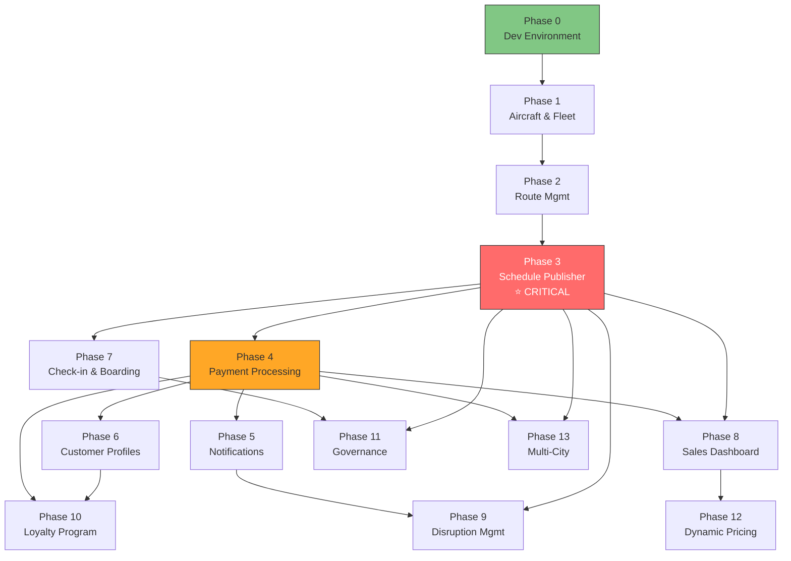

# DeltaBlue Jet Air — Phased Implementation Plan

**Version:** 1.0 — February 2026  
**Author:** Engineering Team  
**Status:** Approved — Post Design Sprint  
**References:** [PRD](./prd.md) · [System Architecture](./system_architecture.md) · [Strategic Roadmap](./strategic_roadmap.md) · [Design Sprint Output](./design_sprint_output.md)

---

## How to Read This Document

Each **Phase** is a shippable, testable milestone. Phases are ordered by dependency — each builds on the previous.

Each Phase contains:
- **Goal** — What this phase achieves and why it matters
- **Tasks** — Major work items (numbered P#.T#)
- **Micro-Tasks** — Granular, assignable units of work (numbered P#.T#.M#)
- **Validation Criteria** — How to verify the phase is complete before moving on
- **Depends On** — Which phases must be completed first

---

## Current-State Baseline

Before beginning, here is what **already exists** and is functional:

| Area | Status | Notes |
|------|--------|-------|
| React SPA (Vite + React Router) | ✅ Running | 60+ pages across 13 feature modules |
| Firebase Auth (Email + Google) | ✅ Working | Login, MFA UI, session management |
| Booking Flow UI | ✅ Complete | Search → Results → Fare → Passengers → Seats → Payment → Confirm |
| Check-in Flow UI | ✅ Complete | PNR lookup → seat selection → boarding pass |
| Admin Dashboard UI | ✅ Complete | 30+ admin pages with button wiring (toast feedback) |
| Zustand Stores | ✅ Working | `authStore`, `bookingStore`, `flightsStore`, `uiStore`, `toastStore` |
| Firestore Service | ✅ Read-heavy | CRUD for flights, aircraft, routes, bookings |
| Cloud Functions | ⚠️ Stubs only | `createPaymentIntent`, `processRefund`, etc. — callable but no logic |
| Stripe Integration | ⚠️ Test-mode only | Stripe Elements present in UI, no live processing |
| Notification Engine | ⚠️ Templates only | Email/SMS templates exist, no delivery engine |
| Inventory Pipeline | ❌ Missing | Flights are static seed data, not published from schedule |
| Customer CRM | ❌ Missing | Auth profile only — no booking history, loyalty, preferences |
| Sales Intelligence | ❌ Missing | Dashboard shows mock data only |

---

## Phase 0 — Development Environment Hardening

**Goal:** Establish a stable, type-safe development environment so all subsequent phases build on solid ground.  
**Duration:** 2–3 days  
**Depends On:** None

---

### Task 0.1 — TypeScript Strictness & Missing Types

| # | Micro-Task | Detail |
|---|-----------|--------|
| 0.1.1 | Install missing type declarations | `npm i --save-dev @types/react @types/react-dom @types/node` |
| 0.1.2 | Fix all type errors in `src/services/*.ts` | Ensure all service functions have explicit return types |
| 0.1.3 | Fix all type errors in `src/stores/*.ts` | Ensure all Zustand stores are fully typed |
| 0.1.4 | Enable `strict: true` in `tsconfig.json` (if not already) | Fix any new errors that surface |

### Task 0.2 — Firebase Emulator Suite Setup

| # | Micro-Task | Detail |
|---|-----------|--------|
| 0.2.1 | Install Firebase CLI locally | `npm i --save-dev firebase-tools` |
| 0.2.2 | Initialize emulators | `firebase init emulators` — enable Auth, Firestore, Functions, Storage |
| 0.2.3 | Create emulator start script | Add `"emulators": "firebase emulators:start"` to `package.json` |
| 0.2.4 | Configure app to detect emulators | Add `connectFirestoreEmulator()`, `connectAuthEmulator()` calls when in dev mode |

### Task 0.3 — Seed Data Foundation

| # | Micro-Task | Detail |
|---|-----------|--------|
| 0.3.1 | Create `scripts/seed.ts` | Script that populates Firestore emulator with baseline data |
| 0.3.2 | Seed 5 aircraft documents | Boeing 737-800, ATR 72-600, Embraer E190, Dash 8 Q400, Boeing 787-8 |
| 0.3.3 | Seed 8 route documents | BJL↔DKR, BJL↔ACC, BJL↔FNA, BJL↔CKY, BJL↔ROB, BJL↔OXB, BJL↔DAD, DKR↔ACC |
| 0.3.4 | Seed 3 test user accounts | Customer, Ops Manager, Super Admin — with correct roles |
| 0.3.5 | Seed 5 sample bookings | Linked to test customer, various statuses (confirmed, pending, cancelled) |

#### Phase 0 — Validation Criteria

- [ ] `npm run build` passes with 0 type errors
- [ ] `npm run dev` starts without warnings
- [ ] Firebase Emulator Suite starts and serves Auth + Firestore + Functions
- [ ] Seed script populates emulator with test data
- [ ] App connects to emulators in development mode and shows seed data

---

## Phase 1 — Aircraft & Fleet Registry

**Goal:** Build the foundation for all inventory — a working aircraft registry with seat configurations that the system can reference.  
**Duration:** 1 week  
**Depends On:** Phase 0  
**PRD Module:** IFC-01, IFC-02

---

### Task 1.1 — Enhanced Aircraft Data Model

| # | Micro-Task | Detail |
|---|-----------|--------|
| 1.1.1 | Extend `AircraftDoc` type definition | Add fields: `maintenanceWindows[]`, `weightLimits`, `rangeKm`, `maxPayload`, `status` (active / maintenance / retired) |
| 1.1.2 | Create `AircraftValidation` schema | Zod or manual validation for required fields, registration format (e.g., `5N-XXX`) |
| 1.1.3 | Update Firestore service | Add `createAircraft()`, `updateAircraft()`, `getAircraftByStatus()` to `firestore.ts` |
| 1.1.4 | Write Firestore security rules for `aircraft` collection | Ops Manager + Super Admin = read/write; others = no access |

### Task 1.2 — Seat Configuration Manager

| # | Micro-Task | Detail |
|---|-----------|--------|
| 1.2.1 | Define `SeatConfigDoc` type | `{ aircraftType, classes: [{ name, rows: { from, to }, seatsPerRow, layout }] }` |
| 1.2.2 | Create `seatConfigService.ts` | Functions: `getSeatConfig(aircraftType)`, `updateSeatConfig(aircraftType, config)` |
| 1.2.3 | Build seat layout preview component | Visual grid showing row×seat layout, colored by class (Economy/Business/First) |
| 1.2.4 | Wire preview into Fleet Management admin page | Show seat config when admin selects an aircraft |

### Task 1.3 — Fleet Management Admin UI Enhancement

| # | Micro-Task | Detail |
|---|-----------|--------|
| 1.3.1 | Enhance `FleetManagement.tsx` aircraft list | Show real data from Firestore instead of static mock |
| 1.3.2 | Build aircraft detail panel | Click aircraft row → side panel with full specs, maintenance history, seat config |
| 1.3.3 | Add "Add Aircraft" form modal | Form with validation, writes to Firestore |
| 1.3.4 | Add "Edit Aircraft" inline editing | Inline edit for status, weight limits; full form for major changes |
| 1.3.5 | Add maintenance window scheduler | Date picker to mark aircraft as unavailable during maintenance |

#### Phase 1 — Validation Criteria

- [ ] Admin can view list of aircraft with real Firestore data
- [ ] Admin can add a new aircraft with registration, type, range, and seat config
- [ ] Admin can edit aircraft status (active → maintenance → active)
- [ ] Seat configuration preview visually matches the aircraft type (e.g., 3-3 for B737 Economy)
- [ ] Maintenance windows correctly mark aircraft as unavailable
- [ ] Firestore security rules block customer-role users from aircraft collection
- [ ] All changes are reflected in Firestore (verify via Firebase Console / emulator UI)

---

## Phase 2 — Route Management

**Goal:** Build a fully functional route management system where ops can create, edit, and manage airline routes with real airport data.  
**Duration:** 1 week  
**Depends On:** Phase 1  
**PRD Module:** IFC-03

---

### Task 2.1 — Route Data Model & Service

| # | Micro-Task | Detail |
|---|-----------|--------|
| 2.1.1 | Enhance `RouteDoc` type definition | Fields: `origin` (airport object), `destination` (airport object), `distanceKm`, `durationMinutes`, `isActive`, `baseFares`, `frequency` |
| 2.1.2 | Create airport reference data | `src/data/airports.ts` — IATA codes, names, coordinates for all DeltaBlue destinations |
| 2.1.3 | Add route service functions | `createRoute()`, `updateRoute()`, `getActiveRoutes()`, `getRoutesForAircraft(rangeKm)` |
| 2.1.4 | Write Firestore security rules for `routes` collection | Same permission model as aircraft |

### Task 2.2 — Route ↔ Aircraft Compatibility

| # | Micro-Task | Detail |
|---|-----------|--------|
| 2.2.1 | Build compatibility filter | When selecting an aircraft for a route, only show aircraft where `rangeKm ≥ route.distanceKm` |
| 2.2.2 | Create `routeAircraftStore.ts` | Zustand store caching route-aircraft compatibility mappings |
| 2.2.3 | Build compatibility matrix view | Table showing which aircraft can serve which routes — visual checkmarks |

### Task 2.3 — Route Management Admin UI

| # | Micro-Task | Detail |
|---|-----------|--------|
| 2.3.1 | Build Route list page | Table of all routes with origin, destination, distance, status, compatible aircraft count |
| 2.3.2 | Build "Add Route" form | Dropdowns for origin/destination airports, auto-calculate distance, set base fares per class |
| 2.3.3 | Build route detail view | Show route info, assigned aircraft history, flight history, revenue (stub for now) |
| 2.3.4 | Add route activation/deactivation | Toggle isActive with confirmation dialog |
| 2.3.5 | Wire into existing admin sidebar | Add "Route Management" under Operations section |

#### Phase 2 — Validation Criteria

- [ ] Admin can view all routes with airport codes, distance, and status
- [ ] Admin can create a new route (e.g., BJL → ACC) with auto-calculated distance
- [ ] Route creation validates: no duplicate routes, valid airport codes
- [ ] Aircraft compatibility filter correctly shows only aircraft with sufficient range
- [ ] Admin can activate/deactivate routes
- [ ] Route data persists in Firestore and survives page reload

---

## Phase 3 — Schedule Publisher (Inventory Pipeline)

**Goal:** Build the critical missing link — the ability to combine Route + Aircraft + Schedule into published flights that customers can book. This is the single most important phase.  
**Duration:** 2 weeks  
**Depends On:** Phase 1, Phase 2  
**PRD Module:** IFC-04, IFC-05, FOMS-01

---

### Task 3.1 — Schedule Data Model

| # | Micro-Task | Detail |
|---|-----------|--------|
| 3.1.1 | Create `ScheduleDoc` type | `{ routeId, aircraftId, daysOfWeek[], departureTime, arrivalTime, effectiveFrom, effectiveTo, status }` |
| 3.1.2 | Create schedule service | `createSchedule()`, `publishSchedule()`, `getSchedulesForRoute()`, `getSchedulesForAircraft()` |
| 3.1.3 | Add aircraft conflict detection | Before scheduling, verify aircraft is not already assigned on overlapping dates/times |
| 3.1.4 | Write `schedules` collection security rules | Ops Manager + Super Admin only |

### Task 3.2 — Flight Generation Engine

| # | Micro-Task | Detail |
|---|-----------|--------|
| 3.2.1 | Build `generateFlights()` function | Input: schedule config → Output: array of `FlightDoc` objects for each date in range that matches `daysOfWeek` |
| 3.2.2 | Auto-generate flight numbers | Format: `DB-{routeSequence}{dayVariant}` (e.g., DB-101, DB-102) |
| 3.2.3 | Copy seat inventory from aircraft config | For each generated flight, populate `seatsAvailable` from `AircraftDoc.seatConfig` |
| 3.2.4 | Set base fares from route config | Copy `route.baseFares` to each flight — Economy, Business, First class pricing |
| 3.2.5 | Build flight preview component | Table showing all flights that will be created before publishing |

### Task 3.3 — Publication Wizard UI

| # | Micro-Task | Detail |
|---|-----------|--------|
| 3.3.1 | Build Step 1: Route Selection | Dropdown of active routes with details (distance, duration) |
| 3.3.2 | Build Step 2: Aircraft Assignment | Filtered dropdown (range ≥ distance), shows seat config summary |
| 3.3.3 | Build Step 3: Schedule Configuration | Day-of-week checkboxes, time pickers, date range selectors |
| 3.3.4 | Build Step 4: Preview & Confirm | Show generated flights in scrollable table with edit capability |
| 3.3.5 | Build Step 5: Publication | Batch-write all flights to Firestore, show success summary with count |
| 3.3.6 | Add wizard progress indicator | Stepper component showing current position (1/5, 2/5, etc.) |

### Task 3.4 — Flight Lifecycle Management

| # | Micro-Task | Detail |
|---|-----------|--------|
| 3.4.1 | Implement flight status transitions | `scheduled → boarding → departed → in_air → landed → arrived` |
| 3.4.2 | Build status update UI | Dropdown on flight detail page, with confirmation and audit log entry |
| 3.4.3 | Build flight withdrawal function | Cancel a published flight, emit events for affected bookings |
| 3.4.4 | Add audit logging on all flight mutations | Write to `audit_logs` on create, status change, cancel |

### Task 3.5 — Booking System Integration

| # | Micro-Task | Detail |
|---|-----------|--------|
| 3.5.1 | Update `searchFlights()` query | Only return flights where `status === 'scheduled'` AND `departureDate > now` |
| 3.5.2 | Show real seat availability on search results | Query `seatsAvailable` from Firestore instead of static data |
| 3.5.3 | Wire seat map to real inventory | Seat selection page queries live `FlightDoc.seatsAvailable` |
| 3.5.4 | Implement seat reservation transaction | Firestore transaction: check seat available → mark as reserved → create booking |
| 3.5.5 | Handle seat conflict (race condition) | If transaction fails, reload seat map and prompt user to re-select |

#### Phase 3 — Validation Criteria

- [ ] Ops Manager can complete the full 5-step publication wizard
- [ ] Publishing generates correct number of flights (e.g., Mon/Wed/Fri for 3 months = ~39 flights)
- [ ] Each generated flight has proper seat inventory copied from aircraft
- [ ] Each generated flight has proper fares from route configuration
- [ ] Published flights appear in customer flight search
- [ ] Customer can select a seat and the seat is reserved via Firestore transaction
- [ ] Two customers cannot book the same seat (transaction conflict handled gracefully)
- [ ] Ops Manager can change flight status through lifecycle stages
- [ ] Ops Manager can withdraw a published flight
- [ ] All mutations logged in audit trail
- [ ] Zero static/mock data used in booking flow — all data comes from Firestore

---

## Phase 4 — Payment Processing

**Goal:** Replace payment stubs with live Stripe integration so customer bookings result in actual charges and confirmed tickets.  
**Duration:** 2 weeks  
**Depends On:** Phase 3 (needs real bookings to process payments for)  
**PRD Module:** BMS-P01 through BMS-P05

---

### Task 4.1 — Cloud Functions Setup

| # | Micro-Task | Detail |
|---|-----------|--------|
| 4.1.1 | Initialize `functions/` directory | `firebase init functions` — Node.js 18, TypeScript |
| 4.1.2 | Configure Stripe SDK in Cloud Functions | Install `stripe` package, store API keys in Firebase environment config |
| 4.1.3 | Set up function deployment pipeline | `firebase deploy --only functions` and test locally with emulator |

### Task 4.2 — Payment Intent Flow

| # | Micro-Task | Detail |
|---|-----------|--------|
| 4.2.1 | Implement `createPaymentIntent` Cloud Function | Input: `{ bookingId, amount, currency }` → Creates Stripe PaymentIntent → Returns `clientSecret` |
| 4.2.2 | Create `PaymentDoc` in Firestore on intent creation | Status: `pending`, linked to `bookingId` |
| 4.2.3 | Wire frontend payment page to call `createPaymentIntent` | Replace stub call with real callable function |
| 4.2.4 | Confirm payment client-side with Stripe.js | Use returned `clientSecret` with `stripe.confirmCardPayment()` |

### Task 4.3 — Webhook Handler

| # | Micro-Task | Detail |
|---|-----------|--------|
| 4.3.1 | Implement `handleStripeWebhook` HTTP Cloud Function | Verify webhook signature, parse event type |
| 4.3.2 | Handle `payment_intent.succeeded` | Update `PaymentDoc.status = 'succeeded'`, confirm `BookingDoc`, emit `booking.confirmed` |
| 4.3.3 | Handle `payment_intent.payment_failed` | Update `PaymentDoc.status = 'failed'`, update `BookingDoc.status = 'payment_failed'` |
| 4.3.4 | Handle payment timeout (no webhook in 5 min) | Scheduled function to release held seats for stale pending bookings |
| 4.3.5 | Write webhook security middleware | Validate Stripe signature, reject tampered requests |

### Task 4.4 — Refund Processing

| # | Micro-Task | Detail |
|---|-----------|--------|
| 4.4.1 | Implement `processRefund` Cloud Function | Input: `{ bookingId, amount }` → Stripe refund → Update `PaymentDoc` |
| 4.4.2 | Build refund rules engine | Full refund if > 48h before departure, 50% if 24–48h, no refund < 24h |
| 4.4.3 | Build admin refund UI | Ops Manager can trigger refund from booking detail page with reason |
| 4.4.4 | Release seats on cancellation/refund | Firestore transaction: increment `seatsAvailable`, update booking status |

### Task 4.5 — Payment Confirmation & Receipts

| # | Micro-Task | Detail |
|---|-----------|--------|
| 4.5.1 | Build confirmation page with real payment data | Show PNR, amount charged, last 4 digits, timestamp |
| 4.5.2 | Generate e-ticket number on confirmed booking | Format: `DBJ-{YYYYMMDD}-{SEQ}` |
| 4.5.3 | Store e-ticket in `BookingDoc` | Field `eTicketNumber` written on confirmation |

#### Phase 4 — Validation Criteria

- [ ] Customer can enter card details using Stripe Elements
- [ ] Payment processes through Stripe (test mode with test cards)
- [ ] `PaymentDoc` status transitions correctly: pending → succeeded OR pending → failed
- [ ] `BookingDoc` auto-confirms on successful payment
- [ ] e-Ticket number generated and displayed on confirmation page
- [ ] Failed payment shows error message and allows retry
- [ ] Pending bookings that time out (5 min) automatically release held seats
- [ ] Ops Manager can initiate refund with correct fare rules applied
- [ ] Refunded booking releases seats back to inventory
- [ ] All payment events logged in audit trail
- [ ] Stripe webhook validates signature and rejects tampered requests

---

## Phase 5 — Notification Engine

**Goal:** Replace notification stubs with real email/SMS delivery so customers receive booking confirmations, check-in reminders, and flight alerts.  
**Duration:** 1 week  
**Depends On:** Phase 4 (needs confirmed bookings to send notifications for)  
**PRD Module:** BMS-P04, FOMS-04

---

### Task 5.1 — Email Delivery Service

| # | Micro-Task | Detail |
|---|-----------|--------|
| 5.1.1 | Set up SendGrid API integration | Install SDK, configure API key in Cloud Functions environment |
| 5.1.2 | Build `sendEmail()` Cloud Function | Input: `{ to, templateId, dynamicData }` → SendGrid API call |
| 5.1.3 | Design booking confirmation email template | PNR, flight details, passenger names, payment summary, e-ticket number |
| 5.1.4 | Design check-in reminder email template | Sent 24h before departure — PNR, flight details, check-in link |
| 5.1.5 | Design flight status change email template | Delay / gate change / cancellation notification |

### Task 5.2 — SMS Delivery Service

| # | Micro-Task | Detail |
|---|-----------|--------|
| 5.2.1 | Set up Twilio API integration | Install SDK, configure Account SID + Auth Token |
| 5.2.2 | Build `sendSMS()` Cloud Function | Input: `{ to, body }` → Twilio API call |
| 5.2.3 | Create SMS templates | Short-form versions of email content for booking confirm, check-in, gate change |

### Task 5.3 — Event-Driven Triggers

| # | Micro-Task | Detail |
|---|-----------|--------|
| 5.3.1 | Trigger email on `booking.confirmed` event | Firestore `onUpdate` trigger on `bookings` collection when status changes to `confirmed` |
| 5.3.2 | Build check-in reminder scheduler | Cloud Scheduler cron job — runs daily, finds flights departing in 24h, sends reminders |
| 5.3.3 | Trigger notification on flight status change | Firestore `onUpdate` on `flights` — when status changes to `delayed` or `cancelled` |
| 5.3.4 | Log all notifications to `notification_logs` | Record: recipient, channel, template, status (sent/failed), timestamp |

#### Phase 5 — Validation Criteria

- [ ] Booking confirmation email sent within 30s of successful payment
- [ ] Email contains correct PNR, flight details, and e-ticket number
- [ ] Check-in reminder email sent 24h before departure
- [ ] Flight delay/cancellation notification reaches affected passengers
- [ ] SMS delivery works for registered phone numbers
- [ ] All notifications logged in `notification_logs` with delivery status
- [ ] Failed deliveries retry 3 times before marking as failed

---

## Phase 6 — Customer Profile & Booking History

**Goal:** Transform the basic auth profile into a full customer record with linked booking history, saved travelers, and preferences.  
**Duration:** 1 week  
**Depends On:** Phase 4  
**PRD Module:** CMS-C01 through CMS-C05

---

### Task 6.1 — Customer Data Model

| # | Micro-Task | Detail |
|---|-----------|--------|
| 6.1.1 | Create `CustomerDoc` type | Extends auth user: `nationality`, `documentType`, `documentNumber`, `phone`, `preferences` |
| 6.1.2 | Create `customerService.ts` | `getCustomer()`, `updateCustomer()`, `getBookingHistory()` |
| 6.1.3 | Auto-create customer profile on first login | Firestore `onCreate` trigger on auth users |
| 6.1.4 | Write `customers` security rules | Users can read/write own profile; admins can read all |

### Task 6.2 — Saved Travelers

| # | Micro-Task | Detail |
|---|-----------|--------|
| 6.2.1 | Create saved travelers sub-collection | `customers/{uid}/savedTravelers/{travelerId}` |
| 6.2.2 | Build "Add Saved Traveler" form | Name, DOB, document type/number, nationality |
| 6.2.3 | Auto-populate passenger form from saved travelers | Dropdown on passenger details page to select saved travelers |

### Task 6.3 — Profile & History UI

| # | Micro-Task | Detail |
|---|-----------|--------|
| 6.3.1 | Build enhanced profile page | Editable profile fields, document upload, preference toggles |
| 6.3.2 | Build booking history tab | Timeline of all bookings with status badges, linked to booking detail |
| 6.3.3 | Build saved travelers management tab | List, add, edit, delete saved travelers |
| 6.3.4 | Link booking confirmation to customer profile | Write `customerId` into `BookingDoc` on booking creation |

#### Phase 6 — Validation Criteria

- [ ] New user gets auto-created customer profile on first login
- [ ] Customer can view and edit their profile (name, phone, document, preferences)
- [ ] Customer can add/edit/remove saved travelers
- [ ] Saved travelers auto-populate passenger form during booking
- [ ] Booking history shows all past bookings with correct status
- [ ] Clicking a booking in history opens full booking detail
- [ ] Firestore security rules prevent users from accessing other users' profiles

---

## Phase 7 — Check-in & Boarding Pass

**Goal:** Connect the existing check-in UI to real booking data and generate downloadable boarding passes.  
**Duration:** 1 week  
**Depends On:** Phase 3, Phase 4  
**PRD Module:** Check-in domain in system architecture

---

### Task 7.1 — Check-in Eligibility

| # | Micro-Task | Detail |
|---|-----------|--------|
| 7.1.1 | Implement `checkEligibility()` service | Verify: booking status is `confirmed`, flight departs within 24h, not already checked in |
| 7.1.2 | Wire PNR lookup to real Firestore query | Replace static lookup with `bookings` collection query by `pnr` + `lastName` |
| 7.1.3 | Show eligibility errors | "Flight departs in 3 days — check-in opens 24h before departure" |

### Task 7.2 — Live Seat Selection at Check-in

| # | Micro-Task | Detail |
|---|-----------|--------|
| 7.2.1 | Load real-time seat map from flight document | Show occupied/available based on `FlightDoc.seatsAvailable` |
| 7.2.2 | Allow seat change during check-in | Release previously assigned seat, reserve new one (Firestore transaction) |
| 7.2.3 | Handle seat conflict at check-in | Same race-condition handling as booking (reload + re-prompt) |

### Task 7.3 — Boarding Pass Generation

| # | Micro-Task | Detail |
|---|-----------|--------|
| 7.3.1 | Build `generateBoardingPass` Cloud Function | Input: checkin data → Generate PDF with barcode |
| 7.3.2 | Store boarding pass PDF in Cloud Storage | Path: `boarding-passes/{bookingId}/{passengerId}.pdf` |
| 7.3.3 | Build boarding pass preview component | In-browser preview with download and print buttons |
| 7.3.4 | Send boarding pass via email | Attach PDF to check-in confirmation email |

#### Phase 7 — Validation Criteria

- [ ] Customer can look up booking by PNR + last name against real Firestore data
- [ ] Check-in rejected if flight departs in > 24h or booking is not confirmed
- [ ] Seat map at check-in shows real occupied seats
- [ ] Customer can change seat during check-in
- [ ] Boarding pass PDF generates with correct flight details, seat, barcode
- [ ] Boarding pass downloadable and printable
- [ ] Check-in status updates to `checked_in` in booking record

---

## Phase 8 — Sales Dashboard & Business Intelligence

**Goal:** Give the CEO and ops team real-time visibility into revenue, bookings, route performance, and inventory status.  
**Duration:** 2 weeks  
**Depends On:** Phase 3, Phase 4  
**PRD Module:** SI-01 through SI-04

---

### Task 8.1 — Sales Data Aggregation

| # | Micro-Task | Detail |
|---|-----------|--------|
| 8.1.1 | Build `aggregateDailySales` scheduled Cloud Function | Daily cron: sum bookings, revenue, cancellations by route, class, and date → write to `sales_daily` |
| 8.1.2 | Build `route_performance` aggregation | Weekly cron: calculate load factor, RASK, revenue per route → write to `route_performance` |
| 8.1.3 | Create `salesStore.ts` | Zustand store with real-time Firestore listener on `sales_daily` |

### Task 8.2 — Dashboard Widgets (Real Data)

| # | Micro-Task | Detail |
|---|-----------|--------|
| 8.2.1 | Replace Dashboard mock metrics with real data | Query `sales_daily` for today's revenue, bookings, active flights |
| 8.2.2 | Build revenue trend chart | Line chart: daily revenue for last 30 days |
| 8.2.3 | Build bookings-by-class donut chart | Economy / Business / First class split |
| 8.2.4 | Build route performance ranking table | Routes sorted by revenue, load factor, with trend arrows |
| 8.2.5 | Build inventory status board | Per-flight: sold / available / pending / cancelled seats |

### Task 8.3 — Export & Reporting

| # | Micro-Task | Detail |
|---|-----------|--------|
| 8.3.1 | Build CSV export for sales data | Export button downloads `sales_daily` data as CSV with date range filter |
| 8.3.2 | Build PDF report generator | Daily/weekly summary report PDF for email distribution |
| 8.3.3 | Wire Dashboard "Export" button to real export | Replace toast with actual CSV download |

#### Phase 8 — Validation Criteria

- [ ] Dashboard shows real revenue, booking count, and active flights from Firestore
- [ ] Revenue chart displays actual historical data (not mock)
- [ ] Route performance table ranks routes by real metrics
- [ ] Inventory board shows correct seat availability per flight
- [ ] CSV export downloads correct data with date range filtering
- [ ] Data refreshes automatically when new bookings come in (real-time listener)

---

## Phase 9 — Disruption Management

**Goal:** Give ops the ability to manage flight disruptions — delays, cancellations, rebooking, gate changes — with automatic passenger notifications.  
**Duration:** 1 week  
**Depends On:** Phase 3, Phase 5  
**PRD Module:** FOMS-03, FOMS-04, FOMS-05

---

### Task 9.1 — Delay Management

| # | Micro-Task | Detail |
|---|-----------|--------|
| 9.1.1 | Build delay recording form | Select flight → enter delay duration + reason code (weather, technical, ATC, crew) |
| 9.1.2 | Update `FlightDoc` with delay info | Fields: `delayMinutes`, `delayReason`, `newDepartureTime` |
| 9.1.3 | Auto-notify affected passengers | Trigger notification (email + SMS) to all passengers on delayed flight |
| 9.1.4 | Update flight search with new departure time | Delayed flights show updated time with "DELAYED" badge |

### Task 9.2 — Gate & Terminal Assignment

| # | Micro-Task | Detail |
|---|-----------|--------|
| 9.2.1 | Build gate assignment function | `assignGate(flightId, gate, terminal)` with conflict detection |
| 9.2.2 | Implement gate conflict detection | Prevent two flights from being assigned same gate at overlapping times |
| 9.2.3 | Wire gate assignment UI in `GateAssignment.tsx` | Replace mock data with real gate assignment from Firestore |
| 9.2.4 | Notify passengers on gate change | Trigger SMS: "Your gate has changed to Gate {X}, Terminal {Y}" |

### Task 9.3 — Flight Cancellation & Rebooking

| # | Micro-Task | Detail |
|---|-----------|--------|
| 9.3.1 | Build cancellation workflow | Ops cancels flight → system finds all affected bookings |
| 9.3.2 | Build rebooking assistant | Show next available flights on same route, allow mass-rebooking |
| 9.3.3 | Auto-refund if no alternative flight | Trigger full refund for passengers not rebooked |
| 9.3.4 | Notify passengers of cancellation + rebooking options | Email with new flight details or refund confirmation |

#### Phase 9 — Validation Criteria

- [ ] Ops can record a flight delay with reason code and new departure time
- [ ] Delayed flight passengers receive email + SMS notification
- [ ] Ops can assign/reassign gates with conflict prevention
- [ ] Gate change triggers SMS to affected passengers
- [ ] Ops can cancel a flight and see list of affected passengers
- [ ] Rebooking assistant shows alternative flights on same route
- [ ] Passengers not rebooked receive automatic refund

---

## Phase 10 — Loyalty Program Foundation

**Goal:** Implement the "DeltaBlue Club" tier system where customers earn points on bookings and progress through tiers.  
**Duration:** 1 week  
**Depends On:** Phase 6 (customer profiles), Phase 4 (confirmed bookings)  
**PRD Module:** CMS-C03

---

### Task 10.1 — Loyalty Data Model

| # | Micro-Task | Detail |
|---|-----------|--------|
| 10.1.1 | Create `LoyaltyDoc` type | `{ uid, tier, totalPoints, lifetimePoints, pointsHistory[], tierExpiryDate }` |
| 10.1.2 | Define tier thresholds | Blue (0), Silver (5,000), Gold (15,000), Platinum (40,000) |
| 10.1.3 | Define points earning rules | Base: $1 = 1 point; Business class: 2x multiplier; First class: 3x multiplier |
| 10.1.4 | Create `loyaltyService.ts` | `awardPoints()`, `getLoyaltyStatus()`, `recalculateTier()` |

### Task 10.2 — Points Accrual & Tier Calculation

| # | Micro-Task | Detail |
|---|-----------|--------|
| 10.2.1 | Award points on booking confirmation | Firestore trigger: on `BookingDoc` status → `confirmed`, calculate and award points |
| 10.2.2 | Build tier recalculation function | After points awarded, check if customer qualifies for next tier |
| 10.2.3 | Deduct points on refund | Reverse points if booking is refunded/cancelled |

### Task 10.3 — Loyalty UI

| # | Micro-Task | Detail |
|---|-----------|--------|
| 10.3.1 | Build loyalty dashboard tab in customer profile | Current tier badge, points balance, progress bar to next tier |
| 10.3.2 | Build points history timeline | List of earn/deduct events with dates, booking references, amounts |
| 10.3.3 | Show loyalty tier in admin user management | Ops can see customer tier, total points, history |

#### Phase 10 — Validation Criteria

- [ ] New customer starts at Blue tier with 0 points
- [ ] Confirmed booking awards correct points (amount × class multiplier)
- [ ] Points are deducted on refund/cancellation
- [ ] Tier auto-upgrades when points threshold reached (e.g., 5,000 → Silver)
- [ ] Customer can view their tier, points balance, and progress on profile page
- [ ] Points history shows all earn/deduct events
- [ ] Admin can view customer loyalty data

---

## Phase 11 — Governance & Compliance

**Goal:** Implement regulatory foundations — passenger manifests, enhanced audit trails, and standard reporting templates.  
**Duration:** 1 week  
**Depends On:** Phase 3, Phase 7  
**PRD Module:** GC-01 through GC-04

---

### Task 11.1 — Passenger Manifest

| # | Micro-Task | Detail |
|---|-----------|--------|
| 11.1.1 | Build manifest generation function | For a flight: query all passengers, compile into regulatory format |
| 11.1.2 | Build manifest export (CSV + PDF) | Standard APIS/PNR format with passenger names, document numbers, nationalities |
| 11.1.3 | Wire into `RegulatoryManifest.tsx` admin page | Replace mock data with real manifest generation |
| 11.1.4 | Add manifest auto-generation trigger | Generate manifest 2h before departure for all checked-in passengers |

### Task 11.2 — Enhanced Audit Trail

| # | Micro-Task | Detail |
|---|-----------|--------|
| 11.2.1 | Implement immutable audit log writes | All system mutations write to `audit_logs` with: userId, action, timestamp, before/after data |
| 11.2.2 | Build audit log search interface | Filter by user, action type, date range, entity type (booking, flight, aircraft) |
| 11.2.3 | Build audit log export | CSV export for compliance reviews |

#### Phase 11 — Validation Criteria

- [ ] Passenger manifest generates correctly for a flight with checked-in passengers
- [ ] Manifest export produces valid CSV and PDF in regulatory format
- [ ] All system actions (booking, payment, flight change, refund) appear in audit log
- [ ] Audit log is searchable by user, action type, and date range
- [ ] Audit log entries are immutable (no edit/delete capability)

---

## Phase 12 — Dynamic Pricing Engine

**Goal:** Adjust fares dynamically based on demand, time-to-departure, and load factor.  
**Duration:** 2 weeks  
**Depends On:** Phase 8 (needs sales data for pricing decisions)  
**PRD Module:** SI-05

---

### Task 12.1 — Pricing Rules Engine

| # | Micro-Task | Detail |
|---|-----------|--------|
| 12.1.1 | Define pricing factors | Time-to-departure buckets, load factor thresholds, day-of-week modifiers |
| 12.1.2 | Build pricing calculation function | Input: base fare + factors → Output: adjusted fare |
| 12.1.3 | Create pricing rules admin UI | Ops can configure multipliers per factor |

### Task 12.2 — Real-Time Fare Adjustment

| # | Micro-Task | Detail |
|---|-----------|--------|
| 12.2.1 | Apply dynamic pricing at search time | Flight search returns adjusted fares based on current load + time-to-departure |
| 12.2.2 | Lock fare at booking time | Once customer starts booking flow, fare is locked for 15 minutes |
| 12.2.3 | Display fare change indicators | "Price is 20% higher than average" or "Great value — prices may increase" |

#### Phase 12 — Validation Criteria

- [ ] Flights with high load factor show increased fares
- [ ] Flights departing within 48h show elevated pricing
- [ ] Low-demand flights show discounted pricing
- [ ] Fare is locked once customer enters booking flow
- [ ] Ops Manager can configure pricing rules from admin

---

## Phase 13 — Multi-City Booking

**Goal:** Allow customers to chain multiple flight segments into a single booking with combined pricing.  
**Duration:** 2 weeks  
**Depends On:** Phase 3, Phase 4  
**PRD Module:** BMS-F07

---

### Task 13.1 — Multi-Segment Data Model

| # | Micro-Task | Detail |
|---|-----------|--------|
| 13.1.1 | Extend `BookingDoc` for multi-segment | Add `segments[]` array with independent flight, seat, and fare per leg |
| 13.1.2 | Build combined fare calculation | Sum segment fares with multi-city discount if applicable |
| 13.1.3 | Create `segments` sub-collection | Each segment links to a different `FlightDoc` |

### Task 13.2 — Multi-City Search UI

| # | Micro-Task | Detail |
|---|-----------|--------|
| 13.2.1 | Extend flight search form | Add "Multi-City" option with dynamic leg addition (2–4 legs) |
| 13.2.2 | Build multi-leg results display | Show results per leg with connection timeline |
| 13.2.3 | Build combined fare summary | Total fare breakdown by leg |

### Task 13.3 — Multi-City Booking Flow

| # | Micro-Task | Detail |
|---|-----------|--------|
| 13.3.1 | Extend passenger form for multi-segment | Passenger details entered once, applied across all segments |
| 13.3.2 | Build per-segment seat selection | Separate seat map for each leg |
| 13.3.3 | Single payment for combined fare | One `PaymentDoc` covering all segments |
| 13.3.4 | Generate single PNR for entire trip | One PNR reference, multiple e-ticket numbers (one per segment) |

#### Phase 13 — Validation Criteria

- [ ] Customer can search for multi-city trips (e.g., BJL → DKR → ACC)
- [ ] Results show per-leg options with combined fare
- [ ] Passenger details apply across all segments
- [ ] Seat selection works independently per leg
- [ ] Single payment processes for full trip amount
- [ ] Single PNR generated with multiple e-tickets
- [ ] Check-in available per segment (not entire trip at once)

---

## Phase Summary & Dependency Graph

---

## Total Estimated Timeline

| Phase | Duration | Cumulative |
|-------|----------|-----------|
| Phase 0 — Dev Environment | 3 days | Week 1 |
| Phase 1 — Aircraft & Fleet | 1 week | Week 2 |
| Phase 2 — Route Management | 1 week | Week 3 |
| Phase 3 — Schedule Publisher ⭐ | 2 weeks | Week 5 |
| Phase 4 — Payment Processing | 2 weeks | Week 7 |
| Phase 5 — Notifications | 1 week | Week 8 |
| Phase 6 — Customer Profiles | 1 week | Week 8 (parallel with P5) |
| Phase 7 — Check-in & Boarding | 1 week | Week 9 |
| Phase 8 — Sales Dashboard | 2 weeks | Week 10 |
| Phase 9 — Disruption Management | 1 week | Week 11 |
| Phase 10 — Loyalty Program | 1 week | Week 11 (parallel with P9) |
| Phase 11 — Governance | 1 week | Week 12 |
| Phase 12 — Dynamic Pricing | 2 weeks | Week 14 |
| Phase 13 — Multi-City Booking | 2 weeks | Week 16 |

> [!TIP]
> **Phases 5+6 and Phases 9+10 can run in parallel** (different engineers, independent concerns), reducing total wall time by ~2 weeks. Realistic delivery: **~14 weeks** with a 2-person engineering team.
