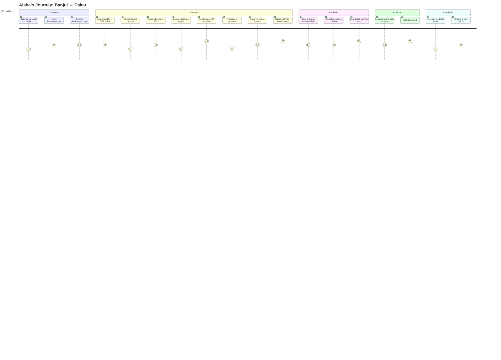

# DeltaBlue Jet Air — Persona Groups, User Journeys & Service Blueprints

**Version:** 1.0 — February 2026

---

## 1. Persona Groups

### Persona 1: Leisure Traveler (Aisha Jallow)

| Attribute | Detail |
|-----------|--------|
| **Age** | 28 |
| **Role** | Customer — infrequent flyer |
| **Location** | Banjul, The Gambia |
| **Goals** | Book affordable flights, visit family in Dakar, easy check-in |
| **Frustrations** | Complex booking flows, hidden fees, no mobile-friendly experience |
| **Tech Savvy** | Medium — uses smartphone primarily |
| **Booking Frequency** | 2–4 trips/year |
| **Primary Channels** | Website (mobile), WhatsApp for support |

> **Aisha says:** *"I just want to book a flight quickly without surprises at checkout."*

---

### Persona 2: Business Traveler (Omar Faye)

| Attribute | Detail |
|-----------|--------|
| **Age** | 42 |
| **Role** | Customer — frequent flyer, corporate |
| **Location** | Dakar, Senegal |
| **Goals** | Fast rebooking, priority service, loyalty rewards, expense reporting |
| **Frustrations** | Rigid change policies, slow check-in, no loyalty recognition |
| **Tech Savvy** | High — laptop + mobile |
| **Booking Frequency** | 2–3 trips/month |
| **Primary Channels** | Website (desktop), email confirmations |

> **Omar says:** *"I need flexibility. If my meeting moves, my flight should move with me."*

---

### Persona 3: Travel Agent (Mariama Ceesay)

| Attribute | Detail |
|-----------|--------|
| **Age** | 35 |
| **Role** | B2B Partner — books on behalf of clients |
| **Location** | Serrekunda, The Gambia |
| **Goals** | Bulk booking, commission tracking, client management |
| **Frustrations** | No agent portal, manual PNR lookups, no group pricing |
| **Tech Savvy** | Medium-High — desktop |
| **Booking Frequency** | 20–50 bookings/month |
| **Primary Channels** | Agent portal (future), email |

> **Mariama says:** *"I need a dashboard where I can manage all my clients' bookings in one place."*

---

### Persona 4: Operations Manager (Lamin Sanneh)

| Attribute | Detail |
|-----------|--------|
| **Age** | 38 |
| **Role** | Internal — flight ops, scheduling, disruption management |
| **Location** | Banjul International Airport |
| **Goals** | Publish schedules, manage disruptions, monitor real-time ops |
| **Frustrations** | No inventory pipeline, manual flight creation, disconnected systems |
| **Tech Savvy** | High — desktop, multiple monitors |
| **Usage** | Daily, 8+ hours |
| **Primary Channels** | Admin dashboard, operational alerts |

> **Lamin says:** *"I should be able to assign an aircraft to a route and have it appear for sale — in one click."*

---

### Persona 5: Super Admin / CEO (Abdou Touray)

| Attribute | Detail |
|-----------|--------|
| **Age** | 50 |
| **Role** | Internal — strategic oversight, revenue, compliance |
| **Location** | Banjul, The Gambia |
| **Goals** | Revenue visibility, route performance, compliance, growth metrics |
| **Frustrations** | No analytics, no sales intelligence, manual reports |
| **Tech Savvy** | Medium — needs clear, visual dashboards |
| **Usage** | Daily, 1–2 hours for review |
| **Primary Channels** | BI dashboards, email reports |

> **Abdou says:** *"Show me which routes make money and which don't — I need to know before the board meeting."*

---

## 2. User Journey Maps

### Journey 1: Leisure Traveler — Book & Fly



#### Touchpoint Matrix — Leisure Traveler

| Phase | Touchpoint | Channel | Emotion | System Module |
|-------|-----------|---------|---------|---------------|
| Discovery | Social ad | External | Curious | Marketing |
| Discovery | Landing page | Web | Interested | CMS |
| Search | Flight search | Web | Hopeful | Booking Mgmt (Frontend) |
| Selection | Fare comparison | Web | Evaluating | Booking Mgmt (Frontend) |
| Booking | Seat selection | Web | Excited | Booking ↔ Inventory |
| Payment | Mobile money | Web | Anxious | Payment Processing |
| Confirmation | PNR email | Email | Relieved | Notification Engine |
| Check-in | Online check-in | Web | Confident | Check-in Service |
| Boarding | Gate scan | Physical | Happy | Flight Operations |
| Post-flight | Feedback survey | Email | Satisfied | Customer Mgmt |

---

### Journey 2: Business Traveler — Book, Change & Fly

#### Touchpoint Matrix — Business Traveler

| Phase | Touchpoint | Channel | Emotion | System Module |
|-------|-----------|---------|---------|---------------|
| Search | Flight search (flexible dates) | Web | Purposeful | Booking Mgmt |
| Booking | Business class selection | Web | Confident | Booking Mgmt |
| Payment | Corporate card | Web | Routine | Payment Processing |
| Change | Meeting changed — needs rebooking | Web | Stressed | Booking Mgmt (Modify) |
| Rebooking | Modifies to next-day flight | Web | Relieved | Booking ↔ Inventory |
| Change fee | Pays fare difference | Web | Accepting | Payment Processing |
| Check-in | Priority check-in | Web | VIP | Check-in Service |
| Lounge | Lounge access (Gold tier) | Physical | Valued | Loyalty Program |
| Post-flight | Expense receipt email | Email | Satisfied | Notification Engine |

**Key Difference from Leisure:** Omar's journey has a **modification loop**. The system must support seamless rebooking with fare-difference calculation, real-time seat availability check on the new flight, and automatic refund/charge processing.

---

### Journey 3: Operations Manager — Publish Schedule

#### Touchpoint Matrix — Operations Manager

| Phase | Touchpoint | Channel | Emotion | System Module |
|-------|-----------|---------|---------|---------------|
| Planning | Reviews route network | Admin Dashboard | Strategic | Route Management |
| Configuration | Selects aircraft for route | Admin Dashboard | Deliberate | Fleet Config |
| Publication | Sets schedule (Mon/Wed/Fri) | Admin Dashboard | Focused | Inventory Pipeline |
| Review | Previews generated flights | Admin Dashboard | Verifying | Inventory Pipeline |
| Publish | Clicks "Publish" | Admin Dashboard | Confident | Inventory Pipeline |
| Monitoring | Watches bookings come in | Sales Dashboard | Hopeful | Sales Intelligence |
| Disruption | Flight delayed 2h — reassigns gate | Admin Dashboard | Urgent | Flight Operations |
| Resolution | Passengers auto-notified | System | Relieved | Notification Engine |

---

### Journey 4: Super Admin — Revenue Review

#### Touchpoint Matrix — Super Admin

| Phase | Touchpoint | Channel | Emotion | System Module |
|-------|-----------|---------|---------|---------------|
| Morning | Opens BI dashboard | Admin Dashboard | Focused | Sales Intelligence |
| Review | Checks daily revenue | Dashboard | Evaluating | BI Dashboards |
| Analysis | Reviews route performance | Dashboard | Strategic | Route Analytics |
| Decision | Flags underperforming route | Dashboard | Decisive | Route Management |
| Action | Requests pricing adjustment | Dashboard / Email | Directing | Dynamic Pricing |
| Compliance | Reviews audit trail | Dashboard | Due diligence | Governance |

---

## 3. Service Blueprints

### Blueprint 1: Booking Flow — End to End

```
┌──────────────────────────────────────────────────────────────────────────────────┐
│ CUSTOMER ACTIONS (FRONTSTAGE)                                                     │
│                                                                                   │
│  Search ──► Results ──► Fare ──► Passengers ──► Seats ──► Payment ──► Confirm    │
│  Flights    Display     Select    Enter Details    Select    Process     PNR       │
│                                                                                   │
├────────────── LINE OF INTERACTION ────────────────────────────────────────────────┤
│                                                                                   │
│ FRONTSTAGE (Visible to Customer)                                                  │
│                                                                                   │
│  Search     Flight    Fare       Pax Form    Seat Map   Stripe      Ticket       │
│  Widget     Cards     Cards      Validation  UI         Elements    Confirmation  │
│                                                                                   │
├────────────── LINE OF VISIBILITY ─────────────────────────────────────────────────┤
│                                                                                   │
│ BACKSTAGE (Invisible to Customer)                                                 │
│                                                                                   │
│  searchFlights()  ──────────────────────►  Query Firestore (published flights)    │
│  getFlightById()  ──────────────────────►  Fetch fare classes + available seats   │
│  createBooking()  ──────────────────────►  Reserve seats (Firestore transaction)  │
│  createPaymentIntent()  ────────────────►  Stripe API call                        │
│  handleStripeWebhook()  ────────────────►  Confirm booking on payment success     │
│  sendBookingConfirmation()  ────────────►  Render email template + send           │
│                                                                                   │
├────────────── LINE OF INTERNAL INTERACTION ───────────────────────────────────────┤
│                                                                                   │
│ SUPPORT PROCESSES                                                                 │
│                                                                                   │
│  Inventory Pipeline     ──► Provides published flights with real seat counts      │
│  Payment Reconciliation ──► Matches Stripe settlements to booking records         │
│  Audit Logger          ──► Records booking.created, payment.succeeded events      │
│  Loyalty Engine        ──► Awards points on confirmed booking                     │
│  Sales Aggregator      ──► Updates daily revenue, route performance metrics       │
│                                                                                   │
└──────────────────────────────────────────────────────────────────────────────────┘
```

#### Failure Points & Recovery

| # | Failure Point | Detection | Recovery |
|---|--------------|-----------|----------|
| F1 | No flights found for route/date | Frontend search returns 0 | Show "No flights" + suggest nearby dates |
| F2 | Seat already taken (race condition) | Firestore transaction conflict | Reload seat map, prompt re-selection |
| F3 | Payment declined | Stripe webhook `payment_intent.payment_failed` | Show error, allow retry with different card |
| F4 | Payment timeout | No webhook within 5 min | Hold booking 15 min, then release seats |
| F5 | Email delivery fails | SendGrid bounce webhook | Retry 3x, log failure, alert CS team |

---

### Blueprint 2: Check-in Flow

```
┌──────────────────────────────────────────────────────────────────────────────────┐
│ CUSTOMER ACTIONS (FRONTSTAGE)                                                     │
│                                                                                   │
│  Enter PNR ──► Select Passengers ──► Declaration ──► Select Seat ──► Boarding    │
│  + Last Name   to check in            Health/Safety    (optional)     Pass        │
│                                                                                   │
├────────────── LINE OF INTERACTION ────────────────────────────────────────────────┤
│                                                                                   │
│ FRONTSTAGE                                                                        │
│                                                                                   │
│  PNR Input   Passenger     Declaration   Seat Map    Boarding Pass               │
│  Form        Checklist     Form          (live)      Download/Print              │
│                                                                                   │
├────────────── LINE OF VISIBILITY ─────────────────────────────────────────────────┤
│                                                                                   │
│ BACKSTAGE                                                                         │
│                                                                                   │
│  checkEligibility()  ────────────────►  Verify booking status + flight timing     │
│  getFlightSeatMap()  ────────────────►  Load layout + occupied seats (txn)        │
│  processCheckin()    ────────────────►  Assign seat (Firestore transaction)        │
│  generateBoardingPass()  ────────────►  Cloud Function → PDF → Cloud Storage      │
│  completeBookingCheckin()  ──────────►  Update booking status to 'checked_in'     │
│                                                                                   │
├────────────── LINE OF INTERNAL INTERACTION ───────────────────────────────────────┤
│                                                                                   │
│ SUPPORT PROCESSES                                                                 │
│                                                                                   │
│  Seat Conflict Prevention  ──► Firestore transaction ensures no double-assignment │
│  Notification Engine       ──► Sends boarding pass email + SMS gate info          │
│  Audit Logger              ──► Records checkin.completed event                    │
│  Flight Ops                ──► Updates passenger manifest in real-time            │
│                                                                                   │
└──────────────────────────────────────────────────────────────────────────────────┘
```

---

### Blueprint 3: Inventory Publication (Operations)

```
┌──────────────────────────────────────────────────────────────────────────────────┐
│ OPS MANAGER ACTIONS (FRONTSTAGE)                                                  │
│                                                                                   │
│  Select Route ──► Assign Aircraft ──► Set Schedule ──► Preview ──► Publish       │
│  (BJL→DKR)       (5N-DBJ B737)       (Mon/Wed/Fri)    Flights     to Sale        │
│                                                                                   │
├────────────── LINE OF INTERACTION ────────────────────────────────────────────────┤
│                                                                                   │
│ FRONTSTAGE (Admin Dashboard)                                                      │
│                                                                                   │
│  Route         Aircraft      Schedule     Flight       Success                   │
│  Selector      Selector      Config       Preview      Notification              │
│  (dropdown)    (filtered)    (calendar)   (table)                                │
│                                                                                   │
├────────────── LINE OF VISIBILITY ─────────────────────────────────────────────────┤
│                                                                                   │
│ BACKSTAGE                                                                         │
│                                                                                   │
│  getRoutes()              ──────────────► Fetch active routes                     │
│  getAircraft()            ──────────────► Filter by range ≥ route distance        │
│  validateSchedule()       ──────────────► Check aircraft not double-booked        │
│  publishSchedule()        ──────────────► Generate FlightDoc per date             │
│  populateSeats()          ──────────────► Copy seatConfig from AircraftDoc        │
│  setBaseFare()            ──────────────► Apply route-level fare template         │
│                                                                                   │
├────────────── LINE OF INTERNAL INTERACTION ───────────────────────────────────────┤
│                                                                                   │
│ SUPPORT PROCESSES                                                                 │
│                                                                                   │
│  Fleet Management     ──► Validates aircraft availability + maintenance windows   │
│  Fare Engine          ──► Applies base fares from route + class configuration     │
│  Audit Logger         ──► Records flight.published event                          │
│  Sales Intelligence   ──► Updates available inventory counts                      │
│                                                                                   │
└──────────────────────────────────────────────────────────────────────────────────┘
```

---

### Blueprint 4: Payment Processing

```
┌──────────────────────────────────────────────────────────────────────────────────┐
│ CUSTOMER ACTIONS                                                                  │
│                                                                                   │
│  Enter Card ──► Click Pay ──► Wait ──► See Confirmation                          │
│                                                                                   │
├────────────── LINE OF INTERACTION ────────────────────────────────────────────────┤
│                                                                                   │
│ FRONTSTAGE                                                                        │
│                                                                                   │
│  Stripe Elements    Loading     Success/Error                                    │
│  (card input)       Spinner     Message                                          │
│                                                                                   │
├────────────── LINE OF VISIBILITY ─────────────────────────────────────────────────┤
│                                                                                   │
│ BACKSTAGE                                                                         │
│                                                                                   │
│  ┌────────────────────────────────────────────────────────────┐                   │
│  │ 1. Frontend calls createPaymentIntent()                    │                   │
│  │ 2. Cloud Function creates Stripe PaymentIntent             │                   │
│  │ 3. Returns clientSecret to frontend                        │                   │
│  │ 4. Stripe.js confirms payment client-side                  │                   │
│  │ 5. Stripe fires webhook → handleStripeWebhook()            │                   │
│  │ 6. Cloud Function updates PaymentDoc (succeeded/failed)    │                   │
│  │ 7. Cloud Function confirms BookingDoc                      │                   │
│  │ 8. Emits booking.confirmed event                           │                   │
│  │ 9. Notification engine sends confirmation email             │                   │
│  │ 10. Sales aggregator updates daily revenue                 │                   │
│  │ 11. Loyalty engine awards points                           │                   │
│  └────────────────────────────────────────────────────────────┘                   │
│                                                                                   │
├────────────── LINE OF INTERNAL INTERACTION ───────────────────────────────────────┤
│                                                                                   │
│ SUPPORT PROCESSES                                                                 │
│                                                                                   │
│  Stripe API            ──► Handles PCI-DSS compliance, card processing            │
│  Reconciliation Job    ──► Daily: matches Stripe settlements to PaymentDocs       │
│  Refund Processor      ──► Handles cancellation → Stripe refund → update docs    │
│  Audit Logger          ──► Records payment.succeeded / payment.failed             │
│                                                                                   │
└──────────────────────────────────────────────────────────────────────────────────┘
```

---

## 4. Persona → System Module Mapping

| System Module | Aisha (Leisure) | Omar (Business) | Mariama (Agent) | Lamin (Ops) | Abdou (Admin) |
|--------------|:-:|:-:|:-:|:-:|:-:|
| **Booking Frontend** | ●  Primary | ● Primary | ● Primary | | |
| **Payment Processing** | ● | ● | ● | | |
| **Check-in** | ● | ● | | | |
| **Manage Booking** | ● | ● Heavy | ● Heavy | | |
| **Customer Profile** | ● | ● | | | ○ View |
| **Loyalty** | ○ Basic | ● Primary | | | ○ Config |
| **Flight Operations** | | | | ● Primary | ○ View |
| **Inventory Pipeline** | | | | ● Primary | ○ Approve |
| **Sales Intelligence** | | | ○ Commission | ● View | ● Primary |
| **CMS** | | | | | ● Primary |
| **Security** | | | | | ● Primary |
| **Governance** | | | | ● Heavy | ● Primary |

**Legend:** ● = Primary user, ○ = Secondary/occasional user

---

## 5. Emotional Design Principles

| Persona | Core Emotion to Design For | Design Principle |
|---------|---------------------------|-----------------|
| **Aisha** | Trust & Simplicity | Clear pricing, no hidden fees, progress indicator |
| **Omar** | Speed & Control | One-click rebooking, saved preferences, priority lanes |
| **Mariama** | Efficiency & Visibility | Bulk actions, commission clarity, client portfolio |
| **Lamin** | Confidence & Precision | Real-time data, validation before publish, rollback |
| **Abdou** | Clarity & Decisiveness | Executive summaries, trend arrows, actionable insights |
