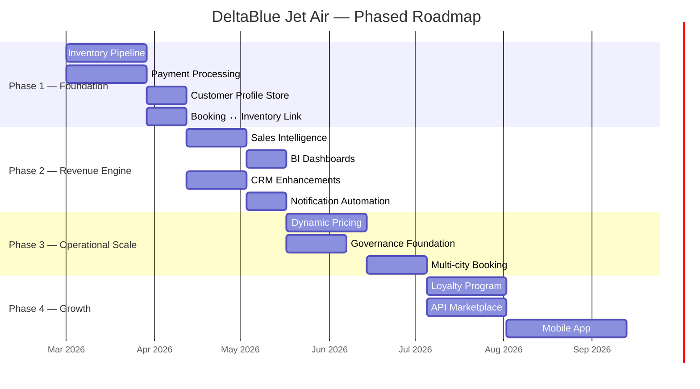
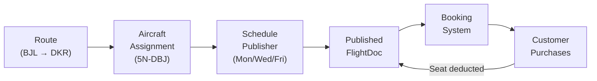
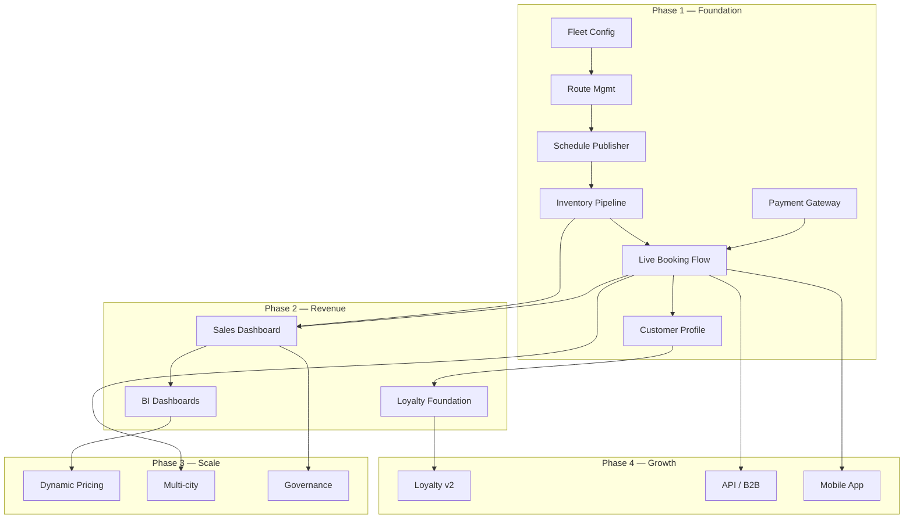

# DeltaBlue Jet Air — Strategic Roadmap

**Version:** 1.0 — February 2026

---

## Phasing Strategy

---

## Phase 1 — Foundation (8 Weeks)

> [!IMPORTANT]
> **Goal:** Build the missing operational backbone that connects the existing booking UI to real inventory and real payments.

### Sprint 1–2: Inventory Pipeline & Payment (Parallel Tracks)

#### Track A: Inventory Publication Pipeline
| Week | Deliverable |
|------|-------------|
| 1 | Upgrade `AircraftDoc` with maintenance sch., weight limits. Build Fleet Config admin UI |
| 2 | Build Route Management admin (CRUD routes, assign aircraft to routes) |
| 3 | Build **Schedule Publisher** — select route + aircraft + date range → generate `FlightDoc` entries |
| 4 | Wire booking `searchFlights()` to only show **published** flights with real-time seat inventory |

**The critical flow:**

#### Track B: Payment Processing
| Week | Deliverable |
|------|-------------|
| 1 | Implement Stripe live-mode in Cloud Functions (`createPaymentIntent`) |
| 2 | Build payment webhook handler → update `PaymentDoc` → confirm `BookingDoc` |
| 3 | Build refund workflow with fare-rule logic |
| 4 | Payment reconciliation — daily settlement report |

### Sprint 3–4: Customer & Booking Integration

| Week | Deliverable |
|------|-------------|
| 5 | Customer Profile CRUD (saved travelers, preferences) |
| 6 | Booking history linked to customer profile |
| 7 | End-to-end integration testing: search → book → pay → confirm → email |
| 8 | UAT, bug fix, hardening |

### Phase 1 Exit Criteria
- ✅ Admin can publish flights from route + aircraft + schedule
- ✅ Customer can search, book, pay, and receive confirmed e-ticket
- ✅ Payment settles via Stripe and status syncs to booking
- ✅ Seat inventory decrements on booking, increments on cancellation

---

## Phase 2 — Revenue Engine (6 Weeks)

> **Goal:** Give the business visibility into what is selling, build intelligence layer.

### Sprint 5–6: Sales Intelligence
| Deliverable | Description |
|-------------|-------------|
| Sales Dashboard | Bookings by route/day/class, revenue, conversion funnel |
| Inventory Status Board | Per-flight: sold / available / pending / cancelled in real-time |
| Revenue Analytics | RASK, load factor, yield per route |
| Route Performance | Ranking, underperformer identification |

### Sprint 7: CRM & Notifications
| Deliverable | Description |
|-------------|-------------|
| Loyalty Foundation | Tier system (Blue → Silver → Gold → Platinum), points accrual |
| Automated Notifications | Booking confirm, check-in reminder, gate change, delay alert |
| Communication Preferences | GDPR-compliant opt-in/out per channel |

### Phase 2 Exit Criteria
- ✅ Ops team has real-time sales visibility
- ✅ Automated email/SMS lifecycle for every booking
- ✅ Loyalty tier assigned on booking

---

## Phase 3 — Operational Scale (6 Weeks)

> **Goal:** Revenue optimization and regulatory readiness.

| Sprint | Deliverable | Description |
|--------|-------------|-------------|
| 8 | Dynamic Pricing Engine | Adjust fares by demand, time-to-departure, load factor |
| 9 | Multi-city Booking | Chain segments, single PNR, combined pricing |
| 10 | Governance Foundation | Regulatory manifest export, enhanced audit trail |
| 10 | Flight Planning (Stub) | Basic fuel, route, altitude data store |

---

## Phase 4 — Growth (Ongoing)

| Deliverable | Description |
|-------------|-------------|
| Loyalty Program v2 | Points redemption, partner integration |
| API Marketplace | B2B API for travel agents, OTAs |
| Mobile App (React Native) | Reuse booking/checkin logic |
| Ancillary Revenue Engine | Baggage, meals, lounge access, priority boarding |
| Crew Management | Crew schedules, qualifications, fatigue rules |

---

## Dependency Graph

---

## Risk Register

| Risk | Impact | Likelihood | Mitigation |
|------|--------|-----------|------------|
| Payment gateway compliance delay | High | Medium | Start Stripe verification immediately |
| Double-booking race conditions | Critical | Low | Firestore transactions already in place |
| Flight schedule data entry errors | High | Medium | Validation rules + preview before publish |
| Scope creep in BI layer | Medium | High | Strict P0-only for Phase 2 launch |
| Performance at scale (Firestore) | High | Low | Index optimization, read caching, pagination |

---

## Resource Requirements

| Role | Phase 1 | Phase 2 | Phase 3 | Phase 4 |
|------|---------|---------|---------|---------|
| Frontend Engineer | 1 | 1 | 1 | 2 |
| Backend / Cloud Functions | 1 | 1 | 1 | 1 |
| Product / Design | 0.5 | 0.5 | 0.5 | 1 |
| QA / Testing | 0.5 | 0.5 | 0.5 | 1 |
| DevOps | 0.25 | 0.25 | 0.5 | 0.5 |
