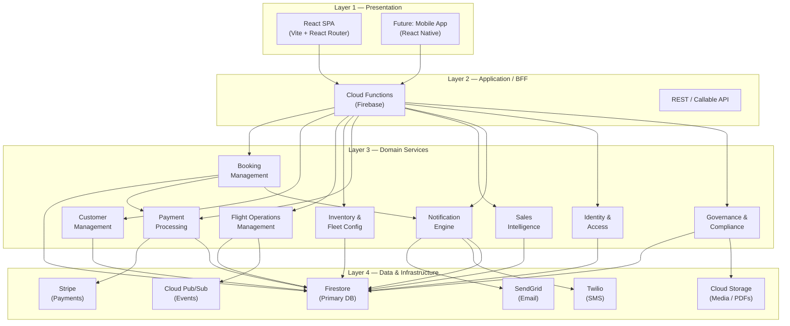
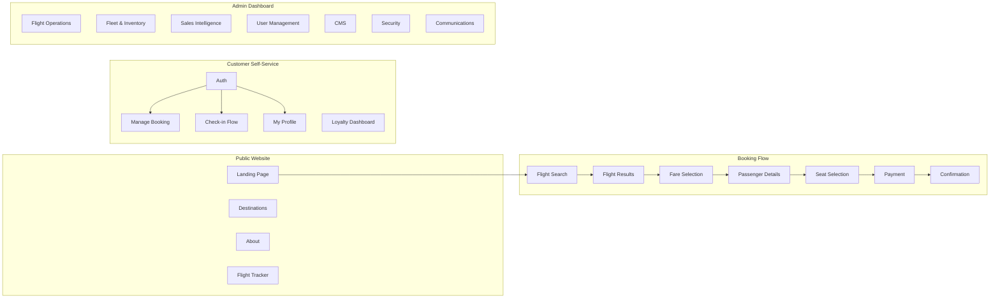
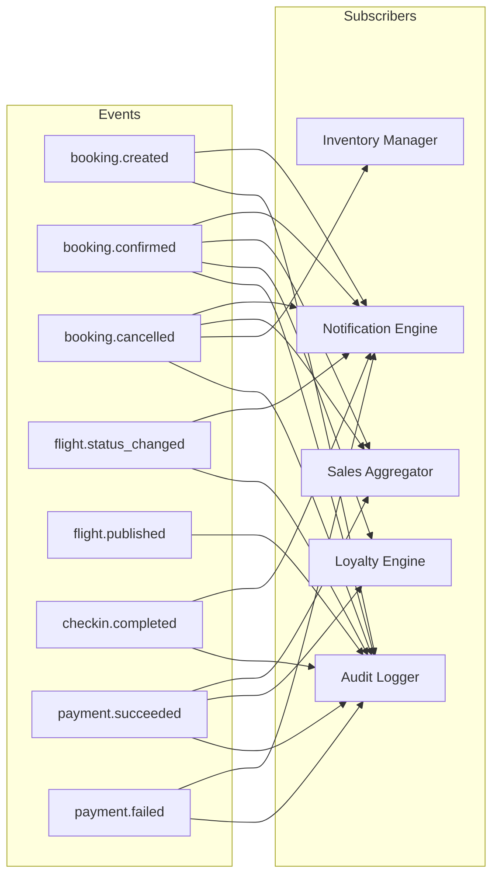
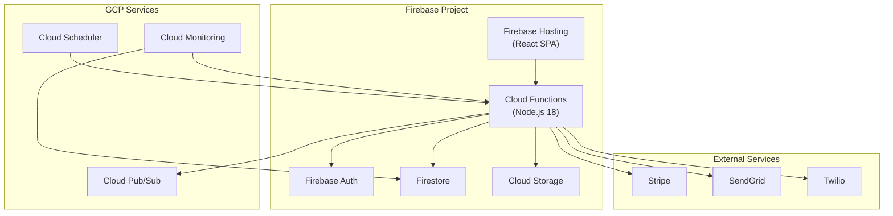

# DeltaBlue Jet Air — System Architecture & Design

**Version:** 1.0 — February 2026

---

## 1. Architecture Overview

### 1.1 Layered Architecture



### 1.2 Technology Stack

| Layer | Technology | Rationale |
|-------|-----------|-----------|
| **Frontend** | React 18 + Vite + React Router | Already in place, fast dev cycle |
| **State** | Zustand | Lightweight, already used (`authStore`, `bookingStore`, `flightsStore`) |
| **Styling** | Tailwind CSS + Custom CSS | Already in place |
| **Backend** | Firebase Cloud Functions (Node.js) | Serverless, scales to zero, GCP-native |
| **Database** | Firestore | Already in place, real-time sync, offline support |
| **Auth** | Firebase Authentication | Already in place, Google + Email providers |
| **Storage** | Cloud Storage for Firebase | Boarding passes, documents, media |
| **Payments** | Stripe | PCI-DSS compliant, global coverage |
| **Notifications** | SendGrid (email) + Twilio (SMS) | Industry standard, template support |
| **Events** | Cloud Pub/Sub | Decoupled event-driven architecture |
| **Monitoring** | Firebase Performance + Crashlytics | Built-in, zero-config |

---

## 2. Component Topology

### 2.1 Frontend Module Map



### 2.2 Service Layer Architecture

| Service | Responsibility | Firestore Collections | Cloud Functions |
|---------|---------------|----------------------|-----------------|
| **BookingService** | Create, modify, cancel, retrieve | `bookings`, `bookings/{id}/passengers` | `createPaymentIntent`, `processRefund`, `sendBookingConfirmation` |
| **CheckinService** | PNR lookup, eligibility, seat conflict prevention, boarding pass | `checkins`, `bookings`, `flights` | `generateBoardingPass` |
| **FlightOpsService** | Flight lifecycle, gate assignment, delay management | `flights` | `updateFlightStatus`, `assignGate` |
| **InventoryService** | **NEW** — Route → aircraft → schedule publication | `routes`, `aircraft`, `flights`, `schedules` | `publishSchedule`, `withdrawFlight` |
| **PaymentService** | **NEW** — Stripe integration, reconciliation | `payments`, `bookings` | `handleStripeWebhook`, `reconcilePayments` |
| **CustomerService** | **NEW** — Profile, loyalty, preferences | `customers`, `loyalty` | `updateLoyaltyTier` |
| **SalesIntelService** | **NEW** — Aggregations, analytics | `sales_daily`, `route_performance` | `aggregateDailySales` |
| **NotificationService** | Email/SMS delivery, template rendering | `notification_logs`, `email_templates`, `sms_templates` | `sendNotification` |
| **AuditService** | Immutable action logging | `audit_logs` | (triggered by other services) |

---

## 3. Data Architecture

### 3.1 Entity Relationship Model

```mermaid
erDiagram
    CUSTOMER ||--o{ BOOKING : places
    CUSTOMER ||--o{ LOYALTY : has
    BOOKING ||--o{ PASSENGER : contains
    BOOKING ||--|| PAYMENT : requires
    BOOKING }o--|| FLIGHT : "books_on"
    FLIGHT }o--|| AIRCRAFT : "assigned_to"
    FLIGHT }o--|| ROUTE : "operates_on"
    ROUTE ||--|| AIRPORT_ORIGIN : from
    ROUTE ||--|| AIRPORT_DEST : to
    AIRCRAFT ||--|| SEAT_MAP : "configured_by"
    PASSENGER ||--o| CHECKIN : "checks_in"
    CHECKIN ||--o| BOARDING_PASS : generates
    FLIGHT ||--o{ SCHEDULE : "published_via"

    CUSTOMER {
        string uid PK
        string email
        string displayName
        string phone
        string tier
    }

    BOOKING {
        string id PK
        string pnr UK
        string customerId FK
        string flightId FK
        string status
        number totalAmount
    }

    FLIGHT {
        string id PK
        string flightNumber
        string routeId FK
        string aircraftId FK
        string status
        map seatsAvailable
    }

    AIRCRAFT {
        string id PK
        string registration UK
        string type
        map seatConfig
        string status
    }

    ROUTE {
        string id PK
        object origin
        object destination
        number distance_km
        boolean isActive
    }

    SCHEDULE {
        string id PK
        string routeId FK
        string aircraftId FK
        array daysOfWeek
        date effectiveFrom
        date effectiveTo
    }
```

### 3.2 Firestore Collection Topology

```
firestore-root/
├── customers/                    # NEW — Customer profiles
│   └── {uid}/
│       ├── profile fields...
│       └── savedTravelers/       # Sub-collection
│           └── {travelerId}/
├── loyalty/                      # NEW — Loyalty accounts
│   └── {uid}/
├── bookings/
│   └── {bookingId}/
│       └── passengers/           # Sub-collection (exists)
│           └── {passengerId}/
├── flights/                      # (exists) — enriched with schedule ref
│   └── {flightId}/
├── aircraft/                     # (exists) — enriched with maintenance
│   └── {aircraftId}/
├── routes/                       # (exists)
│   └── {routeId}/
├── schedules/                    # NEW — Published schedule templates
│   └── {scheduleId}/
├── seat_maps/                    # (exists)
│   └── {aircraftType}/
├── checkins/                     # (exists)
│   └── {checkinId}/
├── payments/                     # (exists) — enriched with reconciliation
│   └── {paymentId}/
├── notification_logs/            # (exists)
│   └── {logId}/
├── email_templates/              # (exists)
├── sms_templates/                # (exists)
├── audit_logs/                   # (exists)
│   └── {logId}/
├── sales_daily/                  # NEW — Daily sales aggregation
│   └── {YYYY-MM-DD}/
├── route_performance/            # NEW — Route analytics
│   └── {routeId}/
└── cms_config/                   # (exists)
    ├── header/
    ├── footer/
    └── about_values/
```

---

## 4. API Design

### 4.1 Cloud Functions Inventory

#### Booking Domain
| Function | Type | Input | Output |
|----------|------|-------|--------|
| `createPaymentIntent` | Callable | `{ bookingId, amount, currency }` | `{ clientSecret, paymentIntentId }` |
| `handleStripeWebhook` | HTTP | Stripe webhook payload | 200/400 |
| `processRefund` | Callable | `{ bookingId, amount }` | `{ refundId, status }` |
| `sendBookingConfirmation` | Callable | `{ bookingId, email }` | `{ success }` |

#### Check-in Domain
| Function | Type | Input | Output |
|----------|------|-------|--------|
| `generateBoardingPass` | Callable | `{ checkinId, bookingId, passengerId }` | `{ boardingPassUrl, boardingGroup }` |

#### Operations Domain
| Function | Type | Input | Output |
|----------|------|-------|--------|
| `publishSchedule` | Callable | `{ routeId, aircraftId, dates[], daysOfWeek[] }` | `{ flightIds[] }` |
| `withdrawFlight` | Callable | `{ flightId, reason }` | `{ success, affectedBookings }` |
| `updateFlightStatus` | Callable | `{ flightId, status }` | `{ success }` |
| `assignGate` | Callable | `{ flightId, gate, terminal }` | `{ success }` |
| `swapAircraft` | Callable | `{ flightId, newAircraftId }` | `{ success, seatRemapping }` |

#### Intelligence Domain
| Function | Type | Input | Output |
|----------|------|-------|--------|
| `aggregateDailySales` | Scheduled | (daily cron) | writes to `sales_daily` |
| `getDashboardStats` | Callable | `{ dateRange }` | `{ revenue, bookings, loadFactor, ... }` |

---

## 5. Event-Driven Architecture



---

## 6. Security Architecture

| Layer | Control |
|-------|---------|
| **Authentication** | Firebase Auth (Email + Google), MFA for admin roles |
| **Authorization** | Role-based: `super_admin`, `ops_manager`, `crew_sched`, `cs_agent`, `customer` |
| **Data Protection** | Firestore Security Rules: customers read own data, admins read all |
| **Payment Security** | PCI-DSS via Stripe (no card data touches our servers) |
| **Audit** | All mutations logged to `audit_logs` with user, action, timestamp |
| **Transport** | HTTPS everywhere (Firebase Hosting enforces TLS) |
| **Session** | Firebase Auth tokens (1hr), refresh tokens, session monitor UI exists |

---

## 7. Deployment Topology


